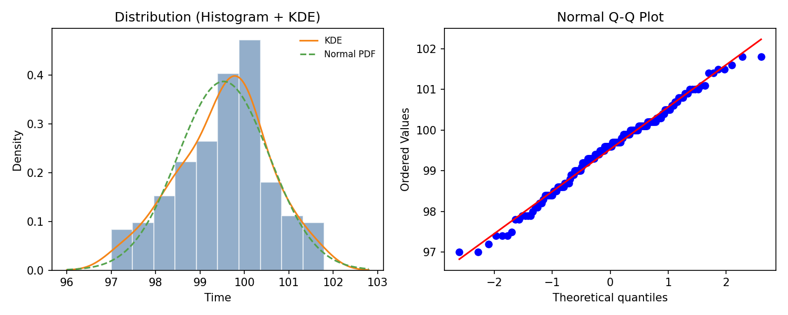

# 樱花跑步时间数据正态性评估

“樱花跑步”为例题中的跑步时间数据名称。

## 数据概况
- 样本量：n = 150
- 均值：99.531 秒
- 标准差：1.031 秒
- 最小值/最大值：97.0 / 101.8 秒

## 可视化结果
分布图见下图（直方图 + KDE + 正态曲线；右侧为 Q-Q 图）：

（图像文件与本报告同目录放置）

## 正态性检验结果（α = 0.05）
- **Shapiro–Wilk**：W = 0.988，p = 0.223
- **Lilliefors（KS 修正）**：D = 0.0665，p = 0.154
- **D’Agostino K²**：p = 0.479
- **Anderson–Darling**：统计量 0.541，小于 5% 临界值 0.748
- **KL 距离（直方图近似，FD 分箱）**：D_KL ≈ 0.0458（结果对分箱敏感）

## 方法选择说明
1. **样本量适中（n=150）**：Shapiro–Wilk 在中小样本下功效高，作为主检方法最合适。
2. **参数未知的 KS 检验修正**：均值与方差由样本估计，应采用 **Lilliefors** 修正而非原始 KS。
3. **尾部敏感性补充**：Anderson–Darling 对尾部偏离更敏感，适合与 Shapiro–Wilk 互补。
4. **偏度/峰度综合检验**：D’Agostino K² 综合评估偏度与峰度是否显著偏离正态。
5. **KL 距离仅作“偏离度量”**：KL 不提供显著性判断，易受分箱/带宽影响，因此仅用于量化“偏离程度”，不作为唯一判定依据。

## 结论
多种检验均未拒绝正态性假设，且 KL 距离较小，结合 Q-Q 图与直方图判断：**该跑步时间数据可认为近似正态分布**。
